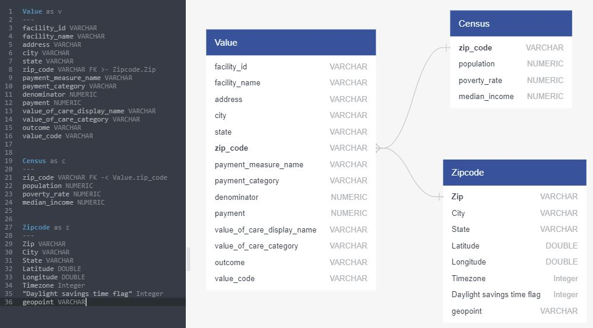
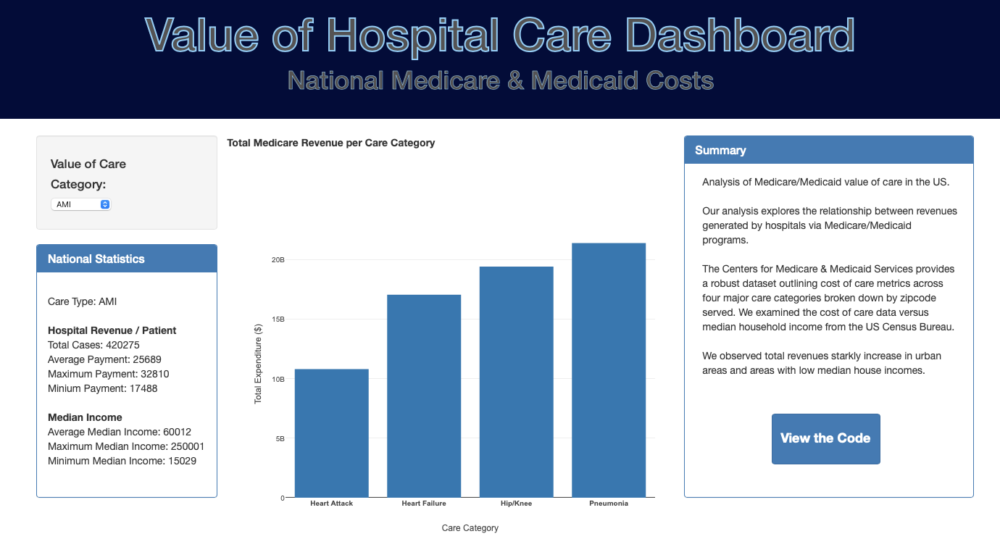
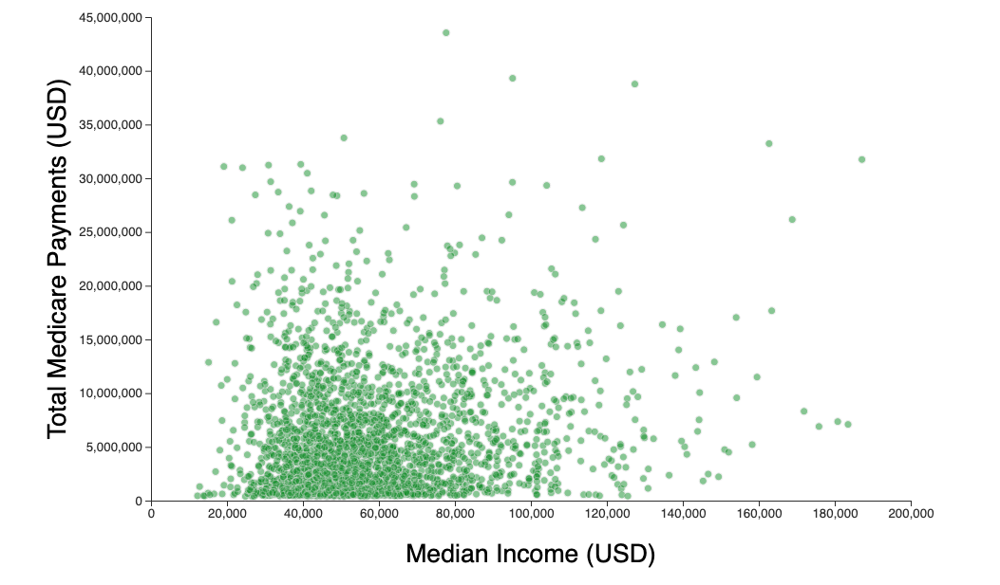
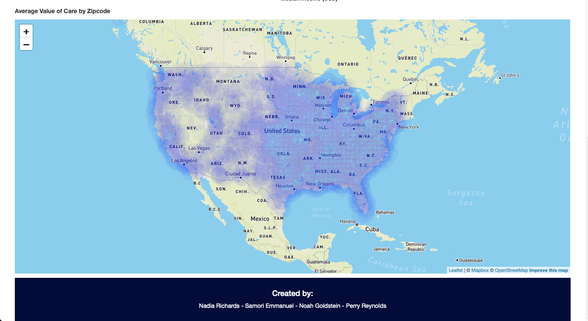

# Full Stack Healthcare Value of Care Analysis Project
By: _**Nadia Richards, Samori Emmanuel, Noah Goldstein, Perry Reynolds**_

## Background
---
In the wake of a global pandemic, public health and healthcare have risen to the forefront of the public eye. Questions have been raised and scenarios proposed about our current healthcare system and the flaws withtin. We took an extensive look at the various care models across the country and how they compare in terms of price paid per condition type, as well as how the price of certain conditions vary across the country. By focusing specifically on Heart Failure, Pneumonia, Hip/Knee Replacements, and Heart Attacks, we were able to take an in depth look at medical data and develop the results detailed below.

## Tools and Technology Used for Analysis
---
* VSCode
* Healthcare Data CSVs
* Python
* Jupyter Notebook
* Pandas
* QuickDBD
* SQL
* PostgreSQL
* APIs
* Javascript
* D3
* Plotly
* Leaflet
* MapBox
* CSS
* HTML
* Flask App

## Process Flow
---
1. CSV and API into Pandas
2. Cleanse data
3. Push data to SQL database
4. Create Flask API
5. Pull data into browser using JavaScript
6. Generate Dashboard using D3, MapBox, Plotly, and Leaflet
7. HTML and CSS formatting / organization

## Data Sources (1 CMS.gov Dataset, 1 Census.gov Dataset, 1 OpenDataSoft.com Dataset)
---
1. **National Payment and Value of Care Data by Hospital:** see dataset [HERE](https://data.cms.gov/provider-data/dataset/c7us-v4mf)
2. **Census Data - Zipcodes, Population, Poverty Rate, and Median Income:** see data source [HERE](https://www.census.gov/data/developers.html)
   - We used the following sources to utilize the census data API:
     - Library Documentation [LINK](https://github.com/datamade/census)
     - Desired data labels [LINK](https://gist.github.com/afhaque/60558290d6efd892351c4b64e5c01e9b)
3. **US Zip Code Latitude and Longitude Coordinates:** see dataset [HERE](https://public.opendatasoft.com/explore/dataset/us-zip-code-latitude-and-longitude/table/?q=&refine.state=NY&location=16,40.76779,-73.96313&basemap=jawg.streets)

## Dataset Values Utilized and Ensuing Relationships (QuickDBD) 
---

## Dashboard Charts & Visualizations
---

## Summary of Findings
---
#### Key Insights From Dashboard
1. When analyzing the heatmap visualization we noticed that the Midwest was rather unpopulated compared to the East and West coasts. We attributed this observation to the fact that the middle third of the United States is significantly less populous than the coasts.
2. When analyzing the scatter plot, we noticed that although the density of zipcodes with Medicare/Medicaid payments is most populous in the $25,000 - $80,000 median household income range, the maximum payments by zipcode is actually highest in the more wealthy median zipcode areas. One potential reason for this observation could be that there is a high density of wealthier elderly patients utilizing Medicare/Medicaid in those regions.
3. Pneumonia was the highest grossing Medicare/Medicaid primary ailment between 2016-2019
#### Main Roadblocks While Developing Full Stack Application
1. While developing our table schema in PostgreSQL, we noticed that our zipcode fields dropped the leading "0" for all instances starting with "0" or "00" from categorizing the field as numeric data rather than string data.
2. Cross Origin integration proved challenging when pulling data into D3 from our Flask API
3. We encountered difficulty with conflicting HTML and CSS coding when formatting our dashboard visualizations, bootstrap cards, svgs, and images
#### Limitations to Our Data
1. The data we utilized only provides gross Medicare/Medicaid payments and does not include self-pay or private insurance reimbursements. The percentage (%) breakdown between Medicare/Medicaid, self-pay and private insurance reimbursements may provide drastically different insights based upon the hospital and population that it serves.
2. The data utilized was gathered from 2016 - 2019, so it is slightly dated
3. There were approximately 50 zipcodes that did not have data fields populated 
#### Additional Thoughts to be Explored Further
1. Average population age per zipcode and its relationship to Medicare/Medicaid payments
2. Variation between care facilities accepting Medicare/Medicaid vs private-only
3. Correlation between Medicare/Medicaid payments with median household income
4. Average cost by primary ailment category
5. Analyze more current data to see how COVID-19 would have impacted our results
6. Analyze similar topics categorized by age groups rather than by zipcode or median income